# Kinesis Advantage 2 PR2024 Redux

## Motivation

I've been an avid Kinesis Advantage 2 (KA2) user for years, but recently
I felt the urge to explore alternative switch options beyond the classic
Cherry MX. Unfortunately, Kinesis stopped offering replacement PCBs around
2022-2023, and my soldering skills aren't quite up to the challenge of
a DIY swap.

That's why this project exists: to completely rewire your KA2 with
custom-designed PCBs, giving you the flexibility to use any switches you
desire without having to deal with the complexity of preserving or
desoldering the original boards. This build leverages the powerful QMK
firmware and RP2040 microcontroller, ensuring a seamless and customizable
experience.

# Ordering PCBs

I've been using [JLCPCB](https://jlcpcb.com). All PCBs are reversible,
so ordering 5x each (minimum order amount) will be enough to rewire
2 keyboards. For the main PCB and the thumb clusters - use the default settings.
For the hand PCB (the one that looks funny and needs to be flexible),
make sure to select 6mm thickness. The gerbers are under `gerbers/` directory.

Note, stock Kinesis PCB is 4mm thick, but 6mm seems to be working fine as
well. Ordering 4mm is 5x more expensive than 6mm. The fit is not 100%
correct, but there is enough slack to make it work.

As of Sep 2024, the prices are (ignoring the shipping cost):
- $6.80 5pcs thumb PCB
- $7.70 5pcs main PCB
- $10.10 5pcs 6mm hand PCB

# BOM

- $1.78 10cm XH2.54 connector cable 5P Double head https://www.aliexpress.us/item/2255800512569466.html
- $1.87 10cm XH2.54 connector cable 6P Double head https://www.aliexpress.us/item/2255800512569466.html
- $2.06 10cm XH2.54 connector cable 7P Double head https://www.aliexpress.us/item/2255800512569466.html
- $1.89 50Pcs XH2.54 ping header 5Pin https://www.aliexpress.us/item/2251832515485565.html
- $2.19 50Pcs XH2.54 ping header 6Pin https://www.aliexpress.us/item/2251832515485565.html
- $2.17 50Pcs XH2.54 ping header 7Pin https://www.aliexpress.us/item/2251832515485565.html
- $1.90 RP2040 https://www.aliexpress.us/item/3256803184741525.html
- $1.04 100pcs 1N4148 diodes https://www.aliexpress.us/item/2255799955957794.html
- 68 MX-style switches

# Build Guide

Start with the disassembly. Remove everything except the top row (which
is being reused as is) and install the new switches.

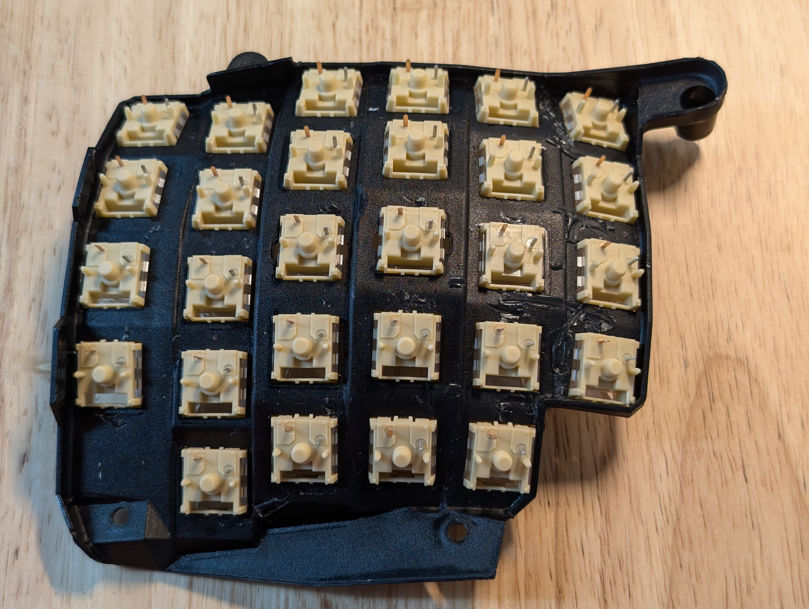
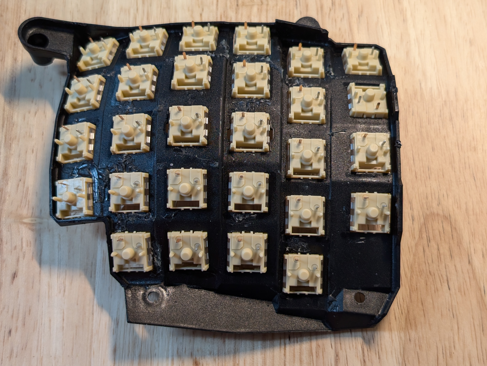

## Hands

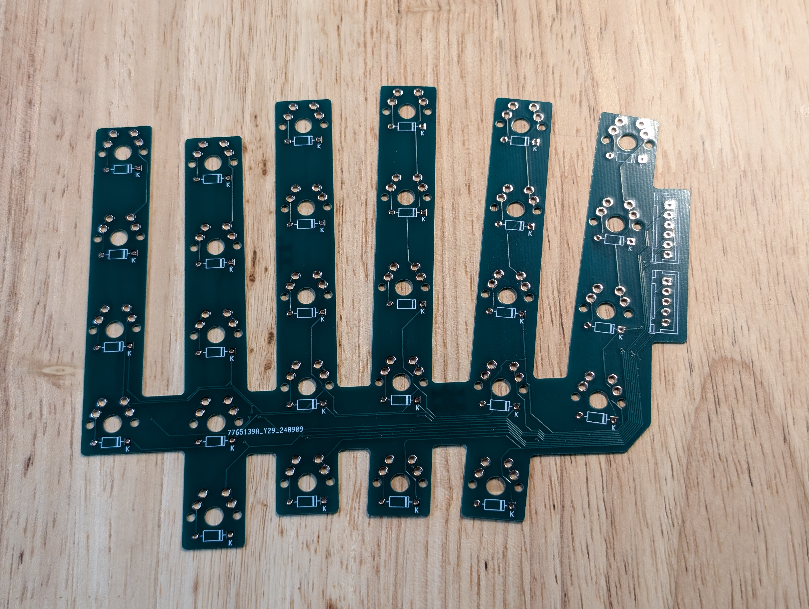
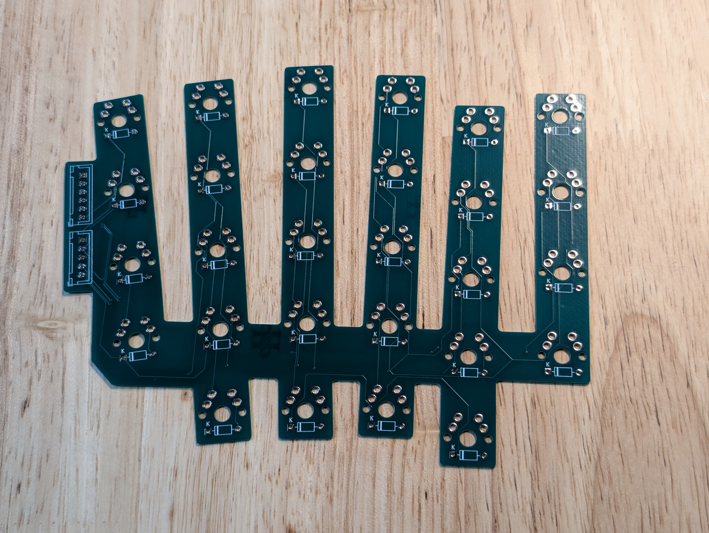

1. Solder diodes (pay attention to the orientation: diodes have a black line
on one side that should align with the line on the pcb) and connectors
(orientation matters for these too; should be easy to deduce the correct
one from the pcb markings).

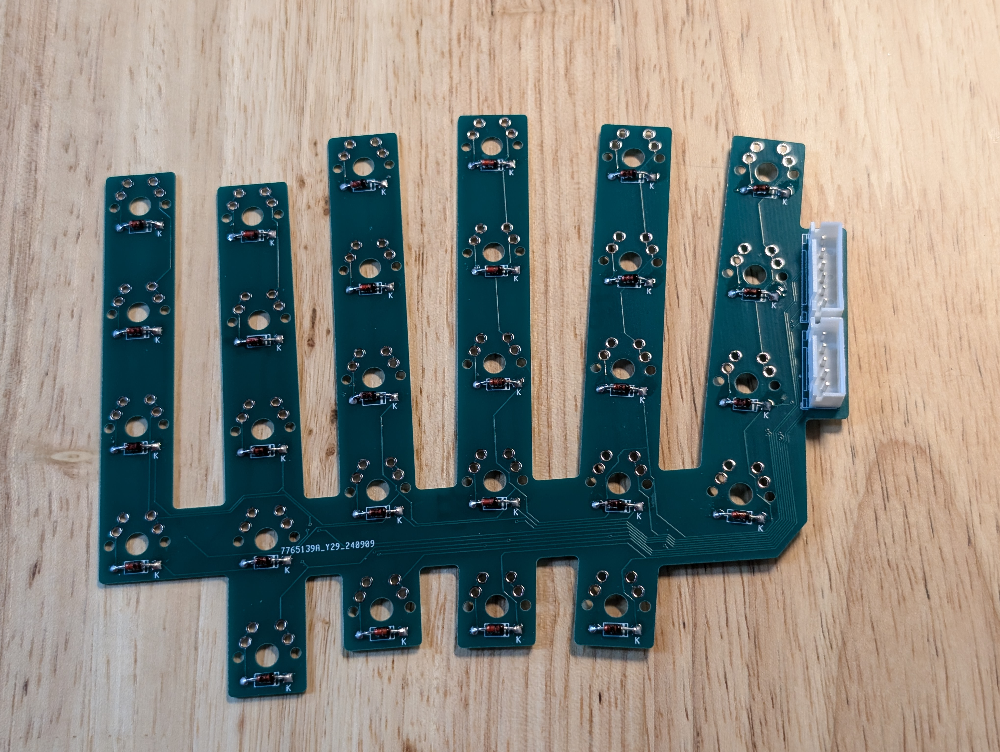
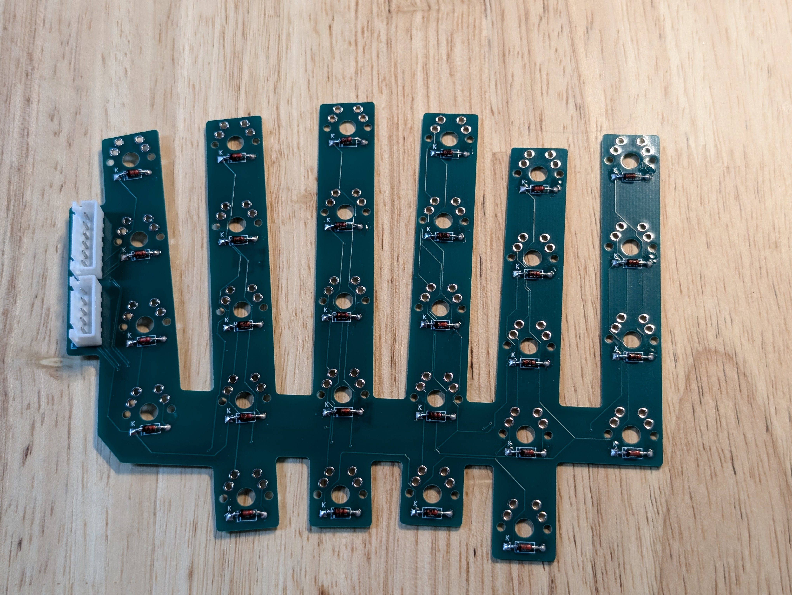

2. Install and solder the middle row. This should leave you enough wiggle
room to fit the rest.

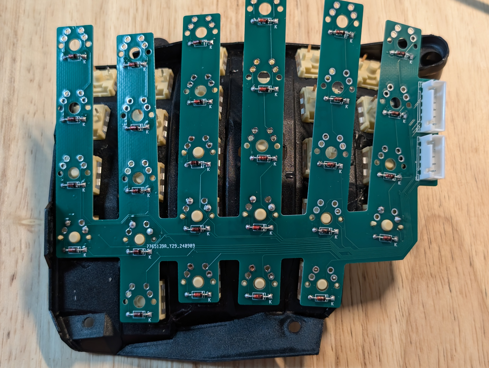


3. Solder the rest of the switches.


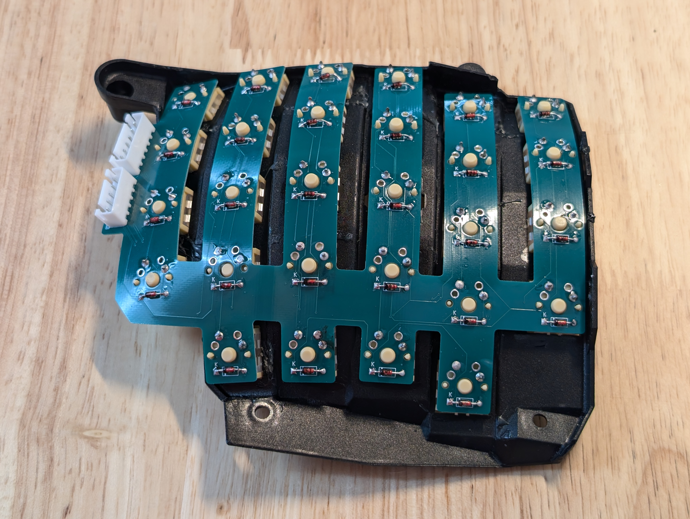

## Thumbs

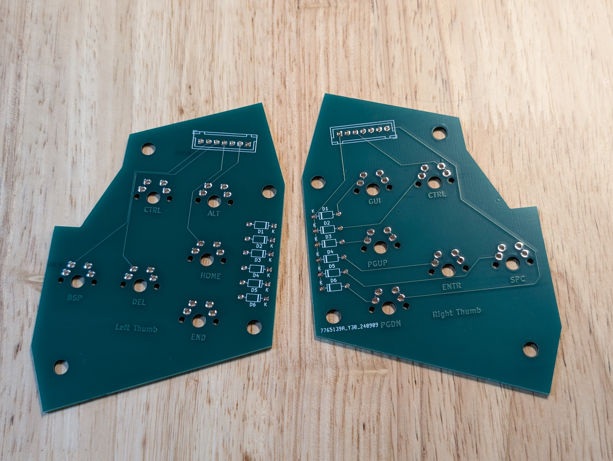

1. Solder diodes and connectors.

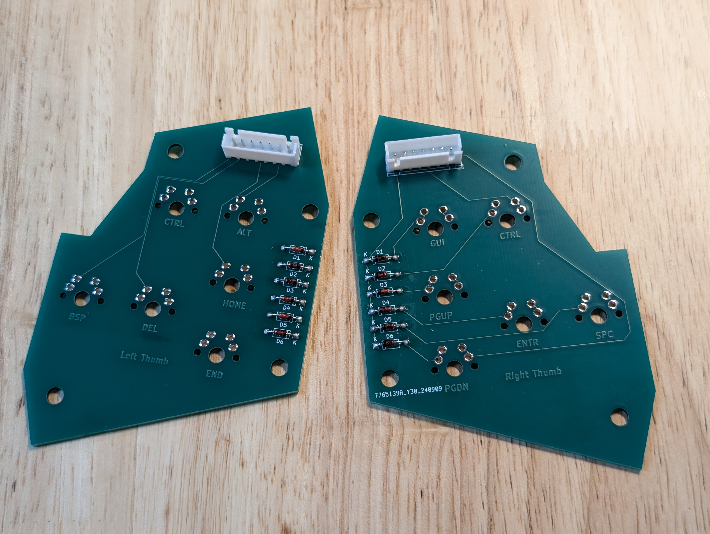

2. Solder the switches.


## Main PCB

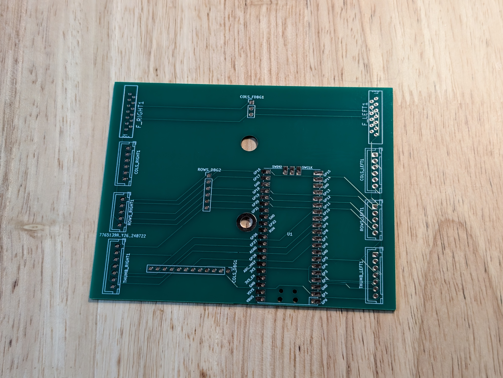

1. Solder PR2040 and connectors. Pay attention to the correct orientation
of the connectors.


## Assemble

Assemble all the pieces.

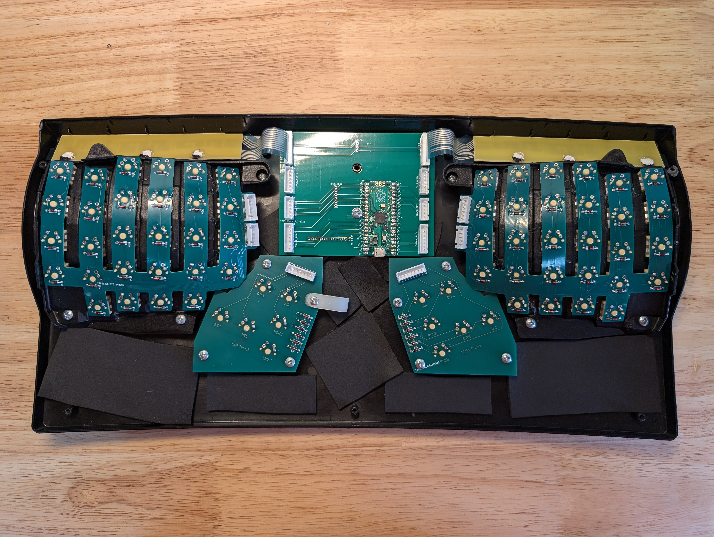

And attach the cables.

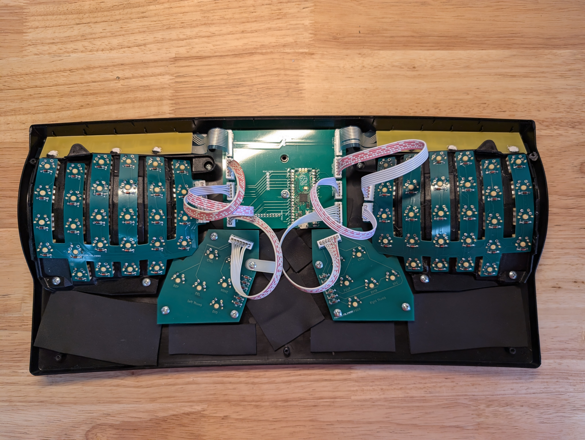

# Software

See [my QMK fork](http://github.com/fomichev/qmk_firmware) for the changes
required:

```
git clone https://github.com/fomichev/qmk_firmware.git
qmk flash -kb kinesis/redux -km fomichev
```

# Keyboard Matrix

The keyboard matrix has nothing in common with the stock Kinesis one (except
functional keys which are reused), so other custom controller won't fit.
It is a bit unconventional due to reverse PCB design.

```
  |     0 |     1 |    2 |    3 |    4 |   5 |   6 |     7 |    8 |    9 |  10 |    11 |  12 |   13 |   14
--+-------+-------+------+------+------+-----+-----+-------+------+------+-----+-------+-----+------+-----
0 |    =  |     1 |    2 |    3 |    4 |   5 |   6 |     7 |    8 |    9 |   0 |     - | ESC |   F1 |   F2
1 |  TAB  |     Q |    W |    E |    R |   T |   Y |     U |    I |    O |   P |     \ |  F3 |   F4 |   F5
2 | CLOCK |     A |    S |    D |    F |   G |   H |     J |    K |    L |   ; |     ' |  F6 |   F7 |   F8
3 | SHIFT |     Z |    X |    C |    V |   B |   N |     M |    < |    > |   ? | SHIFT |  F9 |  F10 |  F11
4 |       |     ` |    | | LEFT | RGHT |     |     |    UP |   DN |    { |   } |       | F12 | PRSC |  SRL
5 |  LALT | LCTRL | HOME |  DEL | BSPC | END | GUI | RCTRL | PGUP | ENTR | SPC |  PGDN | PAU | KEYP | PRGM
```

# Future Design

Potential future design might attempt to reuse FPC cables that come with
the keyboard and use Molex [0039532135 CONN FFC VERT 13POS 1.25MM PCB](https://www.digikey.com/en/products/detail/molex/0039532135/3160262)
connectors. This should make the BOM smaller and slightly cheaper. But
making everything reversible might be a bit of a PITA.
